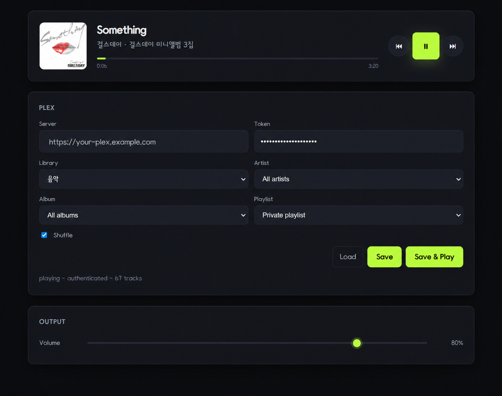
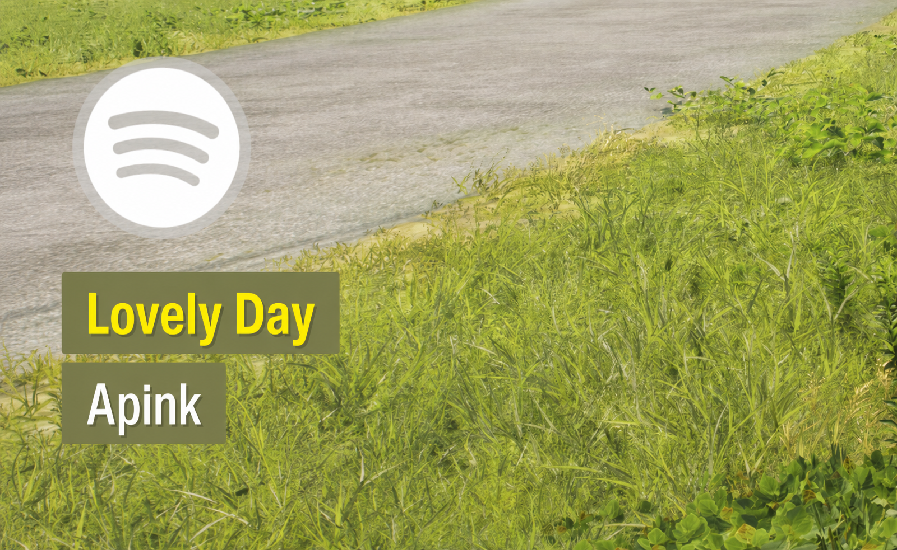

# FH6 Plex Radio

Forza Horizon 6에서 Plex 음악을 인게임 라디오처럼 들을 수 있게 만든 Plex 중심 라디오 모드입니다. 이 프로젝트는 g0ldyy의 FH6 Universal Radio를 기반으로 한 수정 버전이며, Plex 라이브러리, 아티스트, 앨범, 플레이리스트 재생을 로컬 웹 대시보드에서 설정할 수 있도록 바꾼 버전입니다.

영어 README: [README.md](README.md)





## 주요 기능

- 웹 대시보드에서 Plex 서버 설정
- 음악 라이브러리, 아티스트, 앨범, 플레이리스트 선택
- FH6 인게임 라디오 오디오 경로로 출력
- FH6 라디오 볼륨 및 메뉴 진입 시 볼륨 감소 동작 사용
- 게임 시작 시 대시보드 자동 열기 옵션
- 로컬 대시보드: `http://localhost:8420`

## 상태

아직 실험적인 성격이 있으며, 게임 업데이트 이후 동작하지 않을 수 있습니다. 설치 전 백업을 권장하며, 사용에 따른 책임은 사용자에게 있습니다.

## 설치

1. Forza Horizon 6를 종료합니다.
2. 릴리즈 압축 파일을 다운로드합니다.
3. 압축 파일 내용을 `forzahorizon6.exe`가 있는 게임 설치 폴더에 풉니다.
4. 게임을 실행합니다.
5. 게임 오디오 설정에서 `Radio DJ = Off`, `Streamer Mode = On`으로 설정합니다.
6. `http://localhost:8420`을 열고 Plex 설정을 입력합니다.

Xbox 앱 설치 경로 예시는 보통 다음과 비슷합니다.

```text
C:\XboxGames\Forza Horizon 6\Content
```

## Plex 설정

대시보드에서 아래 항목을 설정합니다.

- Plex 서버 URL, 예: `https://your-plex.example.com`
- Plex 토큰
- 음악 라이브러리, 아티스트, 앨범 또는 플레이리스트
- 선택 사항: ffmpeg 경로

실제 Plex 토큰, 개인 설정 파일, 쿠키, 로그는 절대 GitHub에 올리지 마세요. 런타임 설정은 게임 폴더의 `fh6-radio/config.toml`에 저장됩니다.

## 빌드

필요한 환경:

- Windows
- Visual Studio 2022 이상
- Visual Studio의 `Desktop development with C++` 워크로드
- PowerShell

```powershell
powershell -ExecutionPolicy Bypass -File .\scripts\get-deps.ps1
powershell -ExecutionPolicy Bypass -File .\scripts\build.ps1
```

빌드 결과물은 `dist/` 폴더에 생성됩니다.

로컬 빌드를 게임 폴더에 설치하려면:

```powershell
powershell -ExecutionPolicy Bypass -File .\scripts\install.ps1 -GameDir "C:\XboxGames\Forza Horizon 6\Content"
```

## GitHub 릴리즈 체크리스트

바이너리 릴리즈를 배포할 때는 `dist/`에서 아래 파일을 함께 포함하세요.

- `version.dll`
- `fh6-radio/`
- `README.txt`
- `README.ko.md`
- `LICENSE`
- `NOTICE.txt`
- `CHANGES.txt`
- `SOURCE_CODE.txt`
- `THIRD_PARTY_NOTICES.txt`
- `CORRESPONDING_SOURCE.zip`

`CORRESPONDING_SOURCE.zip`은 `scripts/build.ps1` 실행 시 현재 소스 트리 기준으로 자동 생성됩니다.

## 원 저작자 표기

이 프로젝트는 g0ldyy의 FH6 Universal Radio를 기반으로 합니다.

https://github.com/g0ldyy/fh6-universal-radio

저작자 표기와 수정 내역은 `NOTICE.txt`, `CHANGES.txt`를 참고하세요.

## AI 사용 고지

이 Plex 중심 버전을 수정하고 패키징하는 과정에서 Codex 5.5 모델을 AI 개발 보조 도구로 사용했습니다.

## 라이선스

이 프로젝트는 GNU General Public License v3.0으로 배포됩니다. 자세한 내용은 `LICENSE`를 참고하세요.

제3자 컴포넌트 고지는 `THIRD_PARTY_NOTICES.txt`에 정리되어 있습니다.

## 면책 고지

이 프로젝트는 Turn 10 Studios, Playground Games, Xbox Game Studios, Microsoft, Plex, Forza와 관련이 없으며, 해당 회사들의 공식 승인이나 보증을 받은 프로젝트가 아닙니다. 모든 상표는 각 소유자에게 있습니다. 이 프로젝트는 어떠한 보증 없이 있는 그대로 제공됩니다.
